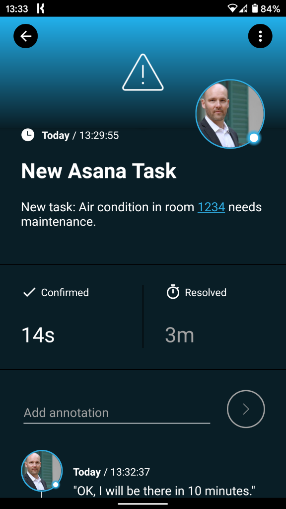
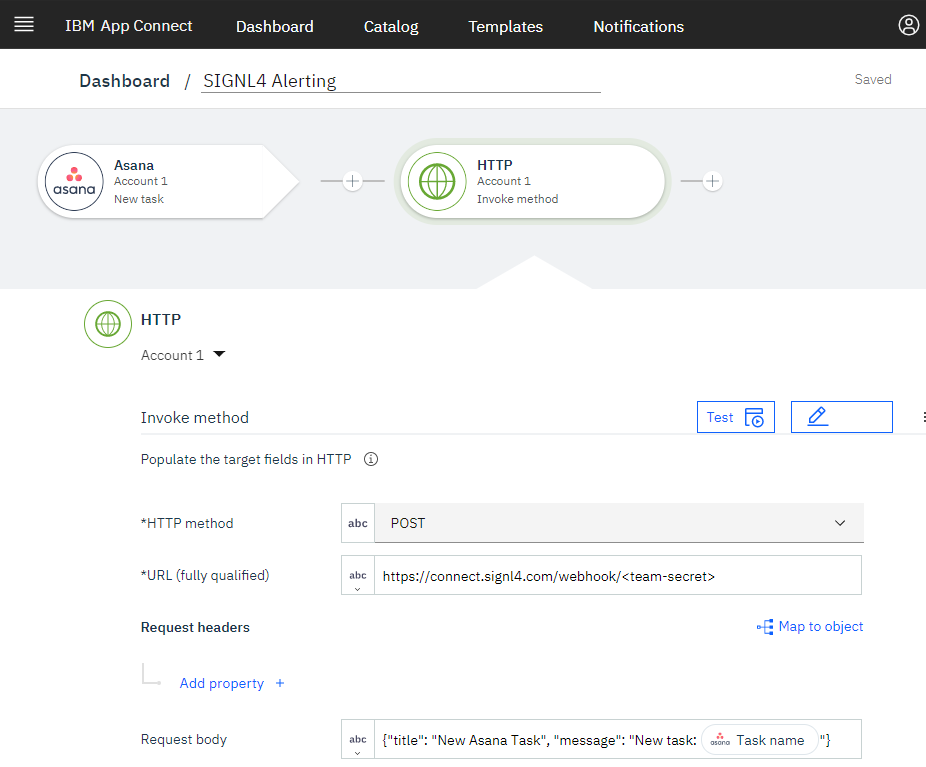

# Mobile Alarmierung per App, SMS und Anruf für IBM App Connect

Mobile Alarmierung mit Tracking, Bereitschafts-Planung und Eskalation für IBM App Connect.

## Warum SIGNL4

IBM App Connect in IBM Cloud ist eine business-freundliche Plattform zur Integration von cloud-basierten oder firmeninternen Anwendungen zur Automatisierung von Aufgaben und Geschäftsprozessen. Durch eine Vielzahl von Integrationen können Sie Anwendungen, Daten, alte Systeme und moderne Technologien sofort miteinander verbinden. Die Integration dieser leistungsstarken Plattform mit SIGNL4 kann Ihren täglichen Betrieb durch die zuverlässige Alarmierung mobiler Teams verbessern, egal wo sich diese befinden.

## So funktioniert es

Alles, was für die Verknüpfung von IBM App Connect mit SIGNL4 nötig ist, ist ein HTTP Request in Ihrem Flow. Dies ermöglicht den Aufruf des SIGNL4-Webhooks und somit die Auslösung eines SIGNL4-Alarms.

## Integration

- Alarmierung von Wartungsteams in SIGNL4 per mobilem Push, Text und Sprache
- Anbindung an SIGNL4 per Email (SMTP API)
- Transparente Quittierung in der mobilen App
- Eskalation von Alarmen wenn eine bestimmte Zeit verstrichen ist
- Team-Kommunikation innerhalb von Alarmen
- Nachvollziehbarkeit der Störungs-Behebung
- Integrierte Bereitschafts-Planung, um die richtigen Personen zur richtigen Zeit zu alarmieren
- Alarmierung über kritische IoT-Status
- Mögliche Zwei-Wege-Integration zur Interaktion mit Geräten

## Szenarien

- Workflow-Automatisierung
- DevOps
- IT-Betriebsabläufe
- Service-Management
- IoT
- Produktion und Fertigung, Versorgungs-Sektor, Öl und Gas, Landwirtschaft, etc.

## Und so funktioniert es

### Integration von SIGNL4 mit IBM App Connect

In unserem Beispiel werden wir die Informationen über einen neuen Task in Asana an unser SIGNL4-Team senden.

SIGNL4 ist eine mobile App mit der Teams schneller und effektiver auf kritische Alarme, technische Störungen und dringende Service-Aufträge reagieren können. Holen Sie sich die App unter https://www.signl4.com.

### Voraussetzungen

Ein SIGNL4-Konto (https://www.signl4.com)

Ein IBM App Connect Konto (https://www.ibm.com/cloud/app-connect)

Ein Asana Konto (https://www.asana.com) für unser Beispiel (optional)

#### Integrations-Schritte

1. Logon auf IBM App Connect  

Loggen Sie sich in der IBM App Connect Plattform unter https://www.ibm.com/cloud/app-connect ein.

2. Anlegen des Flows  

Nun können Sie einen neuen Flow (Event-driven flow) anlegen, der aus zwei Schritten besteht:

1. Asana: Event für eine neuen Asana-Task
2. Http Client: Hier senden wir den HTTP-POST-Request an SIGNL4, um den Alarm auszulösen.

3. Asana  

Unser Application Event ist ein Asana  Task. Dies erfordert eine Authentifizierung mit Ihrem bestehenden Asana-Konto. Der Event löst unseren Workflow jedes Mal aus, wenn ein neuer Task mit den entsprechenden Eigenschaften in Asana erstellt wurde.

4. HTTP Request konfigurieren  

Wir senden einen HTTP-Push-Request an SIGNL4, um einen Alarm auszulösen. Die URL ist Ihre SIGNL4 Webhook-URL inklusive Ihres Team-Secrets. Der Request-Body enthält die JSON-Daten. In unserem Fall setzen wir den Body dynamisch aus den Asana-Task-Daten zusammen.

5. Testen Sie es  

Um den Flow zu testen, können Sie einem neuen Task in Asana anlegen. Dies löst den Flow in IBM App Connect aus und sendet dann die Task-Daten an Ihr SIGNL4-Team.

Ein Beispiel finden Sie auf in GitHub:
https://github.com/signl4/signl4-integration-ibm-app-connect
