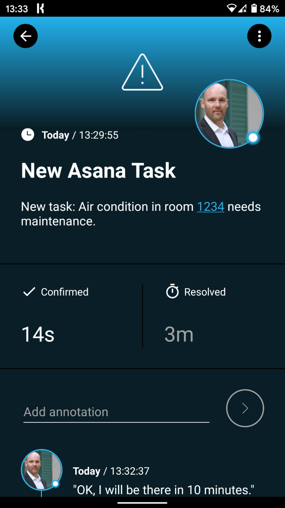

# Mobile alerting with tracking & escalation for IBM App Connect

Mobile alerting with tracking, duty planning and escalation for IBM App Connect.

## Why SIGNL4

IBM App Connect in IBM Cloud is a business-friendly platform for integrating cloud-based or on-premises applications to automate tasks and business processed. You can instantly connect applications, data, heritage systems and modern technologies through a variety of integrations. Pairing this powerful platform with SIGNL4 can enhance your daily operations with an extension to your team wherever it is.

## How it Works

All it takes to pair IBM App Connect and SIGNL4 is a simple HTTP request in your flow. This allows to call the SIGNL4 webhook and to trigger an according alert.

## Integration Capabilities

- Service engineers alerted via mobile push, text and voice
- Integration with SIGNL4 via webhook or email (SMTP)
- Staff can acknowledge and take ownership for critical events that occur
- Alerts are escalated in case of no response
- Communicate within an alert to address a particular problem
- Tracking and visibility of problem solutions
- Integrated on-call duty planning
- Alert on critical IoT device states
- Two-way integration to interact or set the device state

## Scenarios

- Workflow automation
- DevOps
- IT operations
- Service Management
- IoT
- IT, Manufacturing, Utility, Oil and Gas, Agriculture, etc.

## How To Integrate

### Integrating SIGNL4 with IBM App Connect

In our example we will send information about a new Task in Asana to our SIGNL4 team.

SIGNL4 is a mobile alert notification app for powerful alerting, alert management and mobile assignment of work items. Get the app at https://www.signl4.com.

### Prerequisites

A SIGNL4 (https://www.signl4.com) account

An IBM App Connect (https://www.ibm.com/cloud/app-connect) account

An Asana account (https://www.asana.com) for our example (optional)

#### Integration Steps

1. Logon to IMB App Connect  

Log on to the IBM App Connect platform at https://www.ibm.com/cloud/app-connect.

2. Create the Flow  

Now you can create a new flow (Event-driven flow) consisting of two steps:

1. Asana: Event for a new Asana task
2. HTTP: Here we send the HTTP POST request to SIGNL4 in order to trigger the alert.

3. Asana  

Our application trigger is an Asana task. This requires an authentication with your existing Asana account. The event will start our flow each time a new Task with the respective properties has been created in Asana.

4. Configure the HTTP Request  

We send an HTTP Push request to SIGNL4 in order to trigger an alert. The URL is your SIGNL4 webhook URL including your team secret. The request body is the JSON payload. In our case we assemble the body dynamically from the Asana Task data.

5. Test It  

For testing you can create a new Task in Asana. This will trigger the flow in IBM App Connect and as a result send the task data to your SIGNL4 team.

You can find a sample in GitHub:
https://github.com/signl4/signl4-integration-ibm-app-connect
